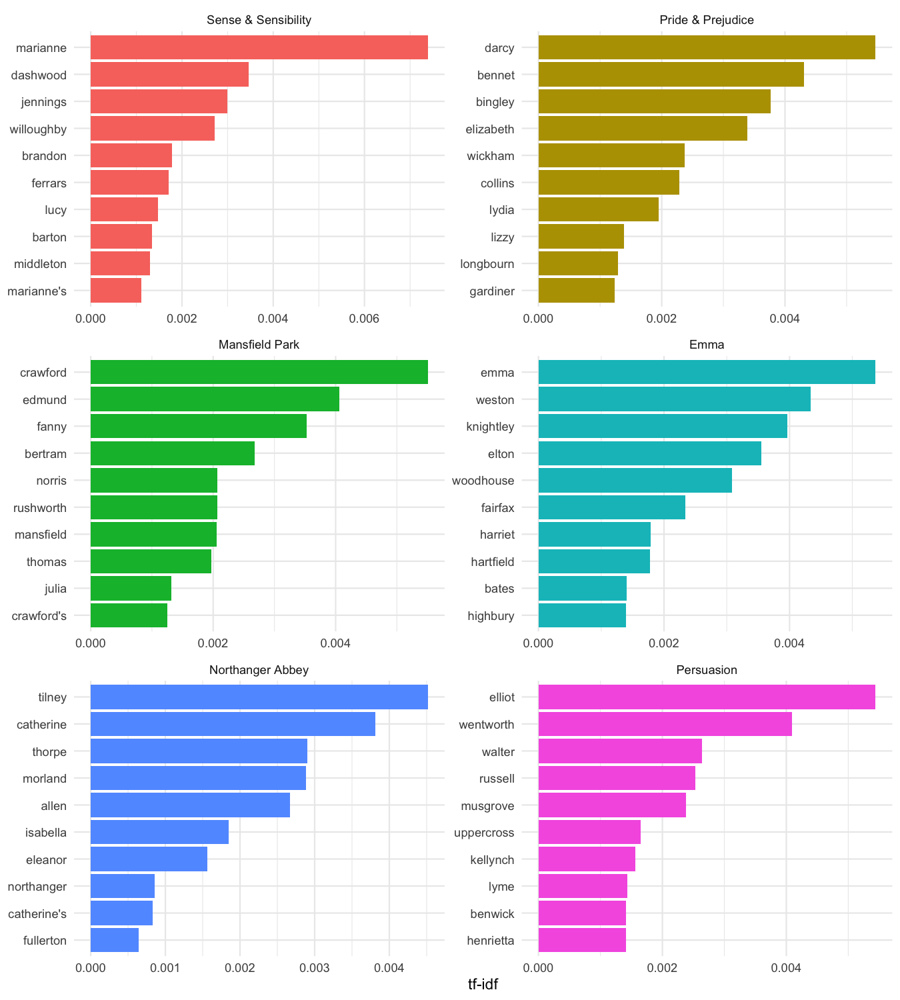

R Notebook Analyse Worthäufigkeiten in Jane Austen Romanen
================

    ## Warning: package 'knitr' was built under R version 4.1.1

``` r
library(dplyr) # Funktionen für Datenmanipulation und -transformation
library(janeaustenr) # Jane Austen Corpus
library(tidytext) # Funktionen für Textanalysen
library(ggplot2) # Funktionen zur Datenvisualisierung
```

Nach [Julia Silge and David Robinson: Text Mining with R. A Tidy
Approach](https://www.tidytextmining.com/tfidf.html).

**Das ist fett** , *das ist kursiv*

### Textkorpus mit sechs Jane Austen Romanen laden

``` r
book_words <- austen_books() %>% # 1. Corpus wird geladen
  unnest_tokens(word, text) %>% # 2. Wörter (tokens) werden je Roman extrahiert
  count(book, word, sort = TRUE) %>% # 3. Wörter werden je Roman gezählt und anschließend sortiert
  ungroup() # 4. Gruppierung für Zählung wurd aufgehoben

#' Gesamtzahl Wörter je Buch
total_words <- book_words %>% 
  group_by(book) %>% 
  summarize(total = sum(n))
total_words %>%
  arrange(desc(total))
```

    ## # A tibble: 6 × 2
    ##   book                 total
    ##   <fct>                <int>
    ## 1 Emma                160996
    ## 2 Mansfield Park      160460
    ## 3 Pride & Prejudice   122204
    ## 4 Sense & Sensibility 119957
    ## 5 Persuasion           83658
    ## 6 Northanger Abbey     77780

``` r
#' zum Datensatz book_word hinzufügen
book_words <- left_join(book_words, total_words)

book_words
```

    ## # A tibble: 40,379 × 4
    ##    book              word      n  total
    ##    <fct>             <chr> <int>  <int>
    ##  1 Mansfield Park    the    6206 160460
    ##  2 Mansfield Park    to     5475 160460
    ##  3 Mansfield Park    and    5438 160460
    ##  4 Emma              to     5239 160996
    ##  5 Emma              the    5201 160996
    ##  6 Emma              and    4896 160996
    ##  7 Mansfield Park    of     4778 160460
    ##  8 Pride & Prejudice the    4331 122204
    ##  9 Emma              of     4291 160996
    ## 10 Pride & Prejudice to     4162 122204
    ## # … with 40,369 more rows

## Tf-idf-Maße berechnen

<https://de.wikipedia.org/wiki/Tf-idf-Ma%C3%9F>

Idee des Tf-idf-Maß ist es, wichtige Wörter in einem Textcorpus zu
finden, indem

-   1.  das Gewicht für häufig verwendete Wörter verringert
        (Vorkommenshäufigkeit)

-   2.  und das Gewicht für Wörter erhöht wird, die in einer Sammlung
        oder einem Korpus von Dokumenten nicht sehr häufig verwendet
        werden (inverse Dokumentenhäufigkeit).

Das R-Paket `tidytext` stellt mit `bind_tf_idf` eine Funktion bereit,
die Tf-idf-Maße berechnet.

``` r
book_words <- book_words %>%
  filter(!word %in% c("churchill", "elinor")) %>%
  bind_tf_idf(word, book, n) %>%
  arrange(desc(tf_idf)) # sortierung nach Tf-idf-Maß absteigend
book_words
```

    ## # A tibble: 40,377 × 7
    ##    book                word          n  total      tf   idf  tf_idf
    ##    <fct>               <chr>     <int>  <int>   <dbl> <dbl>   <dbl>
    ##  1 Sense & Sensibility marianne    492 119957 0.00412  1.79 0.00739
    ##  2 Mansfield Park      crawford    493 160460 0.00307  1.79 0.00551
    ##  3 Pride & Prejudice   darcy       373 122204 0.00305  1.79 0.00547
    ##  4 Persuasion          elliot      254  83658 0.00304  1.79 0.00544
    ##  5 Emma                emma        786 160996 0.00489  1.10 0.00537
    ##  6 Northanger Abbey    tilney      196  77780 0.00252  1.79 0.00452
    ##  7 Emma                weston      389 160996 0.00242  1.79 0.00433
    ##  8 Pride & Prejudice   bennet      294 122204 0.00241  1.79 0.00431
    ##  9 Persuasion          wentworth   191  83658 0.00228  1.79 0.00409
    ## 10 Mansfield Park      edmund      364 160460 0.00227  1.79 0.00406
    ## # … with 40,367 more rows

### Tf-idf-Maße visualisieren

``` r
book_words %>%
  mutate(word = factor(word, levels = rev(unique(word)))) %>% 
  group_by(book) %>% 
  top_n(10) %>%
  ungroup() %>%
  ggplot(aes(word, tf_idf, fill = book)) +
  geom_col(show.legend = FALSE) +
  labs(x = NULL, y = "tf-idf") +
  facet_wrap(~book, ncol = 2, scales = "free") +
  coord_flip() +
  theme_minimal()
```

<!-- -->
